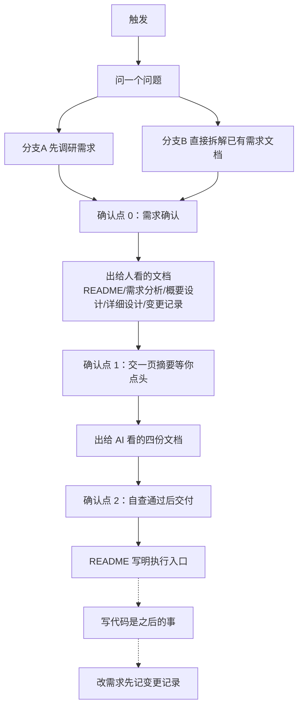

# Spec Forge — 写代码之前，先把文档做好

这个技能只做一件事：**动手写代码之前，先弄清楚要做什么，然后产出两组文档。**

- **给人看的文档**（放 `docs/` 下，中文命名）：需求分析、概要设计、详细设计、变更记录。用大白话讲清楚为什么做、打算怎么做、后来改了什么。目的很实际——过半年回来看，你还能知道这个项目是干嘛的、当时为什么这么定。
- **给 AI 看的文档**（放 `docs/ai-docs/`，固定四份）：规格说明书（spec.md）、执行计划（execution-plan.md）、验收标准（acceptance-criteria.md）、自测计划（test-plan.md）。写得非常较真：需求逐条编号、验收标准每条都能判对错、禁止做什么写得明明白白。AI 拿到这四份，不需要再问任何人，就能把代码写出来、把测试跑通。

两组文档说的是同一件事：一组讲道理，一组立规矩，靠统一的编号互相对应。以后改需求时按编号反查，两边一起改，不会改漏。

> **本技能不区分项目大小，一律产全套文档**：小需求你也不会用这个技能，用上就说明项目值得完整文档。唯一例外：详细设计本身就很小（单模块、无复杂架构）时，概要设计可在确认点 1 经用户确认后省略——但默认要产。
>
> 本文件中标【强制】的步骤必须按序执行，跳步就是违规；标（可选）的才可以跳过。

## 0. 流程总览



## 1. 第一步：问一个问题【强制】

触发技能后，只问一个选择题（给出推荐项和理由），不要让用户写作文：

| 情况 | 走哪条路 |
|---|---|
| 只有想法、说不清楚 | **分支 A：先调研需求**（见 §4） |
| 已有需求文档（PRD、需求段落、用户故事都算） | **分支 B：直接拆解**（见 §5） |
| 文档组已经交付过，这次是改需求 | 直接进 §9 变更流程 |

**不再问项目大小、文档给谁看**——一律产固定全套（见 §2），不需要用户在这上面做选择题。

## 2. 必须产出的文档（固定全套）【强制：缺一份即违规】

```
docs/
├── README.md                  # 一句话定位 + 文档索引 + 执行入口
├── 1-需求分析.md               # 需求文档的根：做什么、做到什么程度
├── 2-概要设计.md              # 系统怎么搭、为什么这么搭（AD-x 唯一家）
├── 3-详细设计.md              # 每个模块怎么实现 + 数据库设计（必产，别处无表结构）
├── 4-变更记录.md               # 交付后一切变更的唯一入口
├── 5-验收报告.md              # 编码完成后逐条回填验收结果
├── 文档清单与导航.md          # 文档超过 6 份时生成（可选）
├── 原型/                      # 有前端时（可选）
└── ai-docs/
    ├── spec.md                # 规格说明书：需求全集 + 技术栈 + 契约 + 禁止行为
    ├── execution-plan.md      # 执行计划：执行纪律 + 任务清单 + 追踪矩阵
    ├── acceptance-criteria.md # 验收标准：每条都能判对错
    └── test-plan.md           # 自测计划：用例从验收标准派生
```

**唯一可省略项**：详细设计本身就很小（单模块、无复杂架构）时，2-概要设计 可在确认点 1 经用户点头后省略。除此之外一份都不能少——尤其 **3-详细设计 必产**（数据库设计、表结构只在它里面，别处没有家）。

## 2.1 血缘关系：文档是怎么长出来的【强制理解，生成时的依据】

这组文档不是并列的，是一条**逐级细化**的链。生成下一级时，上一级就是它的输入规范：

```
1-需求分析（源头：REQ / 范围 / 排除项 / BR 草稿）
   │ 细化：可增不可改
   ▼
2-概要设计（产品说明书 + 技术骨架：模块 / 选型 / 架构 / AD 决策）
   │ 细化：可增不可改
   ▼
3-详细设计（实现细节：接口 / 表结构 / 错误码 / 时序。契约诞生地，人类看）
   │
   ├──────────────┐
   ▼              ▼
ai-docs/spec.md  （需求全集 ← 需求分析；契约 ← 详设。契约冻结地）
   │
   ├──→ execution-plan（任务 + 追踪矩阵）
   ├──→ acceptance-criteria（验收断言唯一权威）
   └──→ test-plan（用例，从 AC 派生）
```

三条规则（违反即漂移）：

1. **生成逐级向下**：每一级的来源是上一级 + 更上级的血缘（spec 的需求来自需求分析、契约来自详设）。生成下一级时必须读对应的上一级，不能凭空发挥。
2. **细化可增不可改**：下一级可以补充细节（如详设给概设定的模块补类结构、spec 给详设定的契约补工程约定），**但不能改上一级已定的语义**——spec 不能改需求分析的 REQ 范围和排除项，详设不能改概设的模块边界和 AD 决策。要改，走变更流程，不是生成时顺手改。
3. **执行只认最下游**：交付后 AI 干活只读 `ai-docs/` 四件套，不回看人类文档（自包含）；人类日常看概设、实现时看详设。两边是同一事实的两种视图，靠编号对应，靠"生成期对账 + 变更时同步"防漂移。

## 3. 全局规矩

### 3.1 编号系统（两组文档通用，禁止另造）

| 编号 | 含义 | 示例 |
|---|---|---|
| D-x | 需求调研时定下的事 | D-3 |
| SC-x | 核心场景 | SC-1 |
| EX-x | 明确排除项 | EX-1 |
| LAT-x | 后续路线（以后做，但非本期） | LAT-1 |
| RSK-x | 风险 | RSK-1 |
| API-x | 接口契约 | API-1 |
| TBD-x | 待用户拍板的问题（性质：阻塞/已假设） | TBD-2 |
| REQ-F-x.y / REQ-NF-x | 功能需求 / 非功能需求 | REQ-F-2.1 |
| BR-x | 业务规则（草稿在需求分析 §5，正式条目在 spec.md §7） | BR-4 |
| AD-x | 设计决策（**唯一家在 `2-概要设计.md` §9**） | AD-2 |
| T-x | 执行任务 | T-5 |
| AC-x.y / AC-E-x / AC-NF-x | 验收标准（正常 / 排除项 / 非功能） | AC-3.1 |
| TC-x | 自测用例 | TC-7 |
| CHG-x | 一次变更（要写明：新增/修改/移除 + 是否破坏性） | CHG-1 |

追溯链：**REQ →（设计）AD →（任务）T →（验收）AC →（用例）TC**。改需求时按编号反查，两组文档受影响的条目一起改。

**AC-x.y 编号语义**：x = 对应 REQ 的组号，y = 该组下第几条（例：AC-1.1、AC-1.2 都对应 REQ-F-1.x，不是 AC-1.2 对应 REQ-F-1.2）。

**被移除的需求（REMOVED），编号永远保留**：条目不删，改标 [REMOVED] 并注明是哪次变更（CHG-x）。防止需求悄悄消失、没人知道为什么。

### 3.2 文件放哪、叫什么

| 组 | 目录 | 命名 |
|---|---|---|
| 给人看的 | `docs/` | 中文命名，统一纯数字前缀（1-需求分析 / 2-概要设计 / 3-详细设计 / 4-变更记录 / 5-验收报告） |
| 给 AI 看的 | `docs/ai-docs/` | 英文短名（不用考虑人的阅读体验，稳定优先） |

### 3.3 给人看的文档怎么写

逐条执行 `templates/_写作规范.md`。一句话概括：**像人话，不像机器人**——说事实、给理由、每段有干货；每张图后面必须有一段"这张图怎么读"；拿不准的话标 `[假设]` 并记入 TBD。

### 3.4 给 AI 看的文档怎么写

- **自包含**：四份文档互相引用可以，引用 `docs/` 下给人看的文档不行。AI 干活需要的所有事实（需求原文、技术栈、接口、错误处理、命令、前端的颜色间距数值）必须写在四份文档里面。
- **只立规矩，不讲道理**：条目化、编号化，不写背景故事（道理是给人看的文档的事）。
- **每条都能判对错**：写不出 pass/fail 的验收标准就是不合格。
- **给确定值**：技术栈、版本、命令、错误码必须写死；实在定不了的列 TBD，且**必须附上建议的默认值**——执行 AI 干活时旁边没人，得有兜底。

### 3.5 TBD 机制

遇到定不了的事，不要瞎猜：在文档里插 `⚠️ TBD-x`，文末汇总成清单，一次性交给用户拍板。

## 4. 分支 A：需求调研（用户只有想法时）【强制按序】

1. **让用户先说完**，不打断。
2. **复述确认**：用自己的话复述一遍理解（"我听到的是：你要给 X 人群做 Y，解决 Z 这个问题，对吗？"），用户点头后才进入下一轮。这一步不做，3 轮问题可能全部问偏，代价是需求分析建立在误解上。
3. **分批提问**，按下面 8 类，先问范围再问细节。优先出选择题，每批 **3-4 个**（宿主交互卡片单轮通常限 4 问），**总共不超过 3 轮**——问不出来的部分，按合理假设填进文档，标 `[假设]`，记入 TBD（性质标"已假设"），不再追问。建议的 3 轮批次（可微调）：
   - **第 1 轮**：目标与范围 + 现状方案 + 利益相关者 + 约束依赖
   - **第 2 轮**：用户与场景 + 功能需求（含异常流程）
   - **第 3 轮**：非功能需求 + 优先级 + 验收偏好
   - 问询类别（8 类）：
   - 目标与范围（做什么、明确不做什么、**现在是怎么解决的、卡在哪**、**完全新建还是改造现有系统/代码——现有资产在哪**）
   - 利益相关者（最终用户、拍板的人、技术相关方、合规安全——缺谁问谁）
   - 用户与场景（谁用、什么环境、核心流程、**多少人用/同时多少人/一年多少数据**、**角色间权限是否不同——谁能看/改/删**）
   - 功能需求（正常流程、出了错怎么办）
   - 非功能需求（性能、安全、兼容性、易用性，逐类问；缺类标"不适用"）
   - 约束与依赖（技术栈限制、要对接的系统——**对方给什么协议和认证方式/有没有接口文档/稳不稳有没有 SLA**、数据：存量/量级/隐私保留要求、有没有死线、一次交付还是分期）
   - 优先级（用 MoSCoW 问：哪些必须做、哪些应该做、哪些可以做、哪些明确不做）
   - 验收偏好（做到什么程度算做完、**谁来验收/在什么环境验收/要不要演示特定场景**）
   - **冲突处理**：用户前后回答打架，或两轮之间改了主意——记 D-x 写明取舍理由，或升 TBD 交用户拍板，不许自行抹平。
4. **优先级换算（写死）**：Must→P0、Should→P1、Could→P2、**Won't→排除项候选**（用户确认后才写进排除项）。**P0/P1/P2 语义**：P0 = 不做就不算交付；P1 = 本期尽力做；P2 = 有时间才做。**防"全是 Must"**：若 Must 超过需求总量一半（或用户全标 Must），追问"只许做一半，先砍哪些"，迫使用户排序，并把追问结果记 D-x。
5. **每个决定记一笔**（D-x：决定了什么、为什么），写进需求分析的决策记录节。
6. **第 3 轮末尾查漏**：对照易忘功能清单问一句"有没有这几类"——通知（邮件/短信/Webhook）、报表与导出、管理后台/配置界面、历史数据迁移。
7. **确认点 0**：交摘要（模板见 §8），用户点头后才往下走。

## 5. 分支 B：已有需求文档拆解

1. **通读原文档**，拆成一条条需求（REQ），标注来自原文哪一节。
2. **六问查缺口**：每条需求有验收标准吗？非功能需求有吗？出错的流程覆盖了吗？术语前后一致吗？写"不做什么"了吗？**需求之间有矛盾吗（相互冲突或与约束冲突）**？
3. **缺口和矛盾列成 TBD 清单，一次问完**。
4. **文档如果已经比较结构化**（有模块划分、优先级、验收标准、用户故事），按这张表直接落位，能省不少事：

   | 原文档里的东西 | 放到哪 |
   |---|---|
   | 模块/大功能划分 | 需求分析的模块分组 |
   | 需求条目 | REQ-F 编号条目 |
   | 用户故事 | REQ 的"场景来源"字段 |
   | MoSCoW 优先级 | P0/P1/P2（按 §4 第 4 步换算；Won't 进排除项候选） |
   | Given-When-Then 验收 | 直接作为验收标准（AC）的素材 |
   | 利益相关者 / 非功能需求 | 需求分析对应章节 |

5. **确认点 0**：需求条目全集用户点头后，进入文档产出。

## 6. 出文档（一）：给人看的【确认点 1】

按固定全套产出（清单见 §2）：

1. **README.md**：一句话定位 + 文档清单 + 执行入口（写法见 §10）。
2. **1-需求分析.md**：背景与目标、利益相关者与用户、核心场景（SC-x）、功能需求表（编号/描述/优先级/一句话验收/场景来源；**P0 的需求必须附 Given-When-Then 三行草案**）、**业务规则（BR 草稿）**、非功能四类（性能/安全(含合规)/兼容性/易用性）、范围与排除项（EX-x）、**后续路线（LAT-x）**、约束与时间线、**风险（RSK-x）**、决策记录（D-x）、术语表、TBD（含性质列）。
3. **2-概要设计.md**：**产品说明书 + 技术骨架**（平时看得最多的文档）——架构风格及理由、架构图（图后必带解读）、**模块总览表 + 按模块展开的简单说明（职责/内容/关键算法与坑点，CRUD 不展开）**、技术选型（每项绑定理由与被否决方案）、数据概要、部署视图、非功能对策、错误处理策略、**设计决策记录（AD-x 唯一家）**、安全设计、部署与可观测性。**重功能描述、可读性优先，技术细节点到即止，不深入算法与代码结构。唯一可省略件**：详细设计本身很小、经用户确认后可省。
4. **3-详细设计.md**：**必产**——公共约定（命名/错误码/枚举）、逐模块详设（类图/时序图/伪代码/异常边界）、**接口设计（API-x 编号 + 契约完整）**、**数据库设计（ER 图 + 每张表一个独立小节的表结构定义 + 数据字典与索引策略）**、横切机制。**表结构格式：每张表单独一节（标题=表名+表注释），字段表含字段名/类型/约束/字段注释，禁止把所有表挤进一张大表。**
5. **4-变更记录.md**：空表起步。
6. **原型/**（有前端时，可选）：出一个 HTML 原型给你确认观感——颜色对不对看原型比看文档直接得多。颜色间距的数值本身内联进 ai-docs/spec.md，不单独写一份设计规范文档。**原型规范**：命名 `原型/<页面名>.html`，一页一份；页面必须覆盖五态（正常/空/加载/错误/无权限）中适用的状态；用户否决原型后，修订原型再进入确认点 1——不把否决的观感问题带进 AI 文档。
7. **5-验收报告.md**：空表起步（编码完成后回填）。**文档清单与导航.md**：文档超过 6 份时生成。
8. 按 `checklists.md` 的确认点 1 清单自查 → **交一页摘要**（模板见 §8）→ 用户点头后冻结。

## 7. 出文档（二）：给 AI 看的四份【确认点 2】

输入：已确认的需求分析、概要设计、详细设计（只是生成素材，交付后 AI 干活不回来看它们）。

1. **spec.md**：为什么做/本期做什么/影响面、术语表、技术栈与依赖（写死版本）、**需求全集（每条用"当…时，系统应…"的句式写完整，标 [ADDED]）**、范围边界（含禁止实现清单）、输入输出契约（API-x）、业务规则、状态机、错误处理策略、验收索引、工程约定（目录结构、构建/测试/运行命令、环境变量、**前端的颜色间距数值**）、设计约束（**每条配"怎么检查违没违反"的方法**）、禁止行为、遗留事项、完成定义。
2. **execution-plan.md**：**执行纪律四件套**（先定接口再写码 / 每步自查清单 / Git 提交节奏 / 卡住 3 次必须停下来报告）+ 哪些必须串行（写明原因）+ 工程结构 + 任务依赖图 + 任务清单（每条带完成标准和验证命令）+ **追踪矩阵**（REQ→AD→API→T→AC→TC 一张表，改需求时靠它查影响面）。
3. **acceptance-criteria.md**：验收断言全集（Given-When-Then + 判定准则），含"系统不应"的排除项验收、非功能验收。**全组只有这一份写验收断言**，别处只放索引。
4. **test-plan.md**：从验收标准机械派生——环境与命令、用例表（引用 AC 编号）、需求↔验收↔用例覆盖对照表（必须 100%）、回归范围。

任务超过 ~30 个：执行计划拆成 `ai-docs/execution-plan/` 总览 + 分批的分册。

**自查必须做三件事**（checklists.md 确认点 2）：

- **装傻测试**：假装自己是一个只拿到 `ai-docs/` 四份文档、完全不了解背景的执行者，逐项确认能不能开工。
- **生成期对账**：需求/详设 与 AI 文档逐项对齐——REQ/排除项/BR 与需求分析对，API/表/错误码/枚举/技术栈与详设对，编号全库反查无悬空、无复用，数量级口径一致（见 checklists 确认点 2 的"生成期对账"四组检查）。**这步是防漂移的主闸门，不是可选项。**
- **对表**：验收标准与需求分析 P0 的三行是否一致（或已按"草案可修正"在确认点 1 摘要说明）；追踪矩阵是否覆盖全部非 [REMOVED] 需求。

→ **交一页摘要** → 用户点头后交付。

## 8. 每道确认点的摘要模板【强制，一屏以内】

用户不该为了确认而硬读四份契约文档。每个确认点按这个格式交摘要：

```text
【确认点 N】<这步做了什么>
- 产出了：<文档清单，每份一行>
- 范围：<一句话；共几条需求，P0 几条>
- 明确不做：<最多 5 条>
- 风险：<最多 3 条，从需求分析 §9 RSK-x 取，不现场编>
- 等你拍板的 TBD：<只列"阻塞"项：编号 + 事项 + 我建议的默认值>
- 可否决的假设：<列"已假设"项：编号 + 我替你定的 + 理由>
- 需要你确认：<1-3 个具体问题>
```

用户看完摘要就能拍板；想看细节再打开对应文档。

## 9. 交付之后：需求变了怎么办

1. **先记 `4-变更记录.md`**：变更类型（新增/修改/移除）+ 是否破坏性；**移除（REMOVED）必须写清理由和怎么迁移**，否则拒绝进入修订。
2. 按 ai-docs/execution-plan.md 的追踪矩阵反查影响面，两组文档受影响条目**一起改、版本一起升**，更新"与代码同步截止"。
3. 移除的需求在 spec.md 里保留编号、改标 [REMOVED]，注明是哪次变更——**不许物理删除**。
4. 破坏性变更必须重走确认点 1。
5. **版本号递增规则**：小改（改措辞、补说明、不改变行为）→ minor（v1.1）；改行为 / 加删需求 / 动契约 → major（v2.0）；破坏性变更**必须**升 major。

### 9.1 确认点 1 → 确认点 2 之间的回退

> 交付尚未完成（还在出 AI 文档阶段）时发现契约有缺口需要补设计，**不算"交付后变更"**，不记 CHG。处理：回到确认点 1 修订对应的给人看文档（需求分析 / 概要设计 / 详细设计），确认点 1 已冻结的部分按"修改设计 = 重走确认点 1"处理（用户点头），然后继续确认点 2。这一小段回退不需要开变更记录——变更记录从交付后（确认点 2 通过）才开始计。

## 10. 交付时：把执行入口写清楚【强制】

交付时必须在 `docs/README.md` 写明：

1. 项目一句话定位。
2. 文档清单（哪份给谁读）。
3. **执行入口**：新的编码会话**先读 `ai-docs/spec.md`，再读 `execution-plan.md` 的执行纪律**，然后按任务清单干；自测按 test-plan.md；任何变更先记 `4-变更记录.md`，禁止绕过。
4. 如果宿主项目有 AGENTS.md 之类的规则文件：提醒用户把执行入口写进去，让每次会话自动加载。

本技能的职责到确认点 2 交付为止。写代码，是之后的事。

## 11. 模板清单

| 文档 | 模板 |
|---|---|
| README | `templates/README-项目说明.md` |
| 1-需求分析 | `templates/1-需求分析.md` |
| 2-概要设计 | `templates/2-概要设计.md` |
| 3-详细设计 | `templates/3-详细设计.md` |
| 4-变更记录 | `templates/4-变更记录.md` |
| 5-验收报告 | `templates/5-验收报告.md` |
| 文档清单与导航（可选） | `templates/文档清单与导航.md` |
| 写作规范 | `templates/_写作规范.md` |
| ai-docs 四件套 | `templates/ai-docs/` 下同名 |
| 自查清单 | `checklists.md` |

> 模板路径相对于本 SKILL.md 所在目录。**templates/ 目录就是 docs/ 的镜像**——docs 里每个文件对应 templates 里哪个模板，一一对应，无嵌套。
