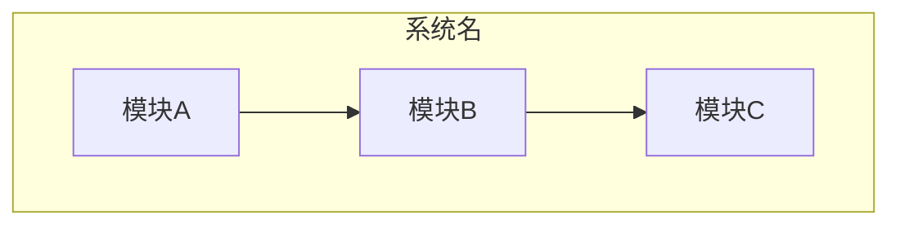
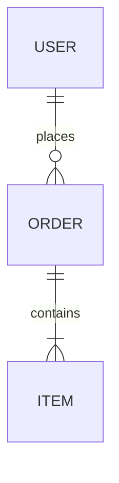
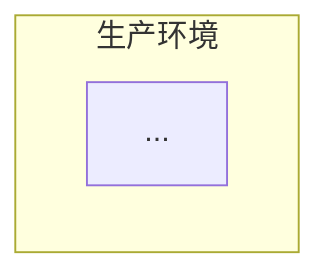

# 模板：2-概要设计

> 使用说明：`docs/2-概要设计.md`。**定位：产品说明书 + 技术骨架**。平时看得最多的文档——读者是有技术背景但非底层程序员的人，重功能描述、可读性优先，技术细节点到即止。讲"系统怎么搭，为什么这么搭"，技术选型带理由，但**不深入算法与代码结构**（那是详设的事）。**默认流程都要产出**；只有详细设计本身就很小（单模块、无复杂架构）的项目才可省。设计决策（AD-x）唯一存档在本文件 §9。叙述遵守 `_写作规范.md`。状态流转：草稿 → 已冻结（确认点 1）。

---

# 概要设计：[项目名称]

| 项 | 内容 |
|---|---|
| 版本 | v1.0 |
| 日期 | YYYY-MM-DD |
| 状态 | 草稿 / 已冻结 |
| 上游 | 1-需求分析 vX.Y |
| 与代码同步截止 | |

## 1. 设计概述

一段话交代：这份设计覆盖什么、不覆盖什么；为满足需求分析的哪些条目而存在；设计目标与非功能约束。范围边界和需求分析的排除项呼应。

## 2. 系统架构

### 2.1 架构风格与理由

（选了什么风格：分层 / 微服务 / 事件驱动 / 单体模块化 / Serverless……为什么它适合这份需求。❌「我们采用微服务架构」——空话。✅「拆成三个服务，因为订单和库存的扩容节奏完全不同，单体发布会互相拖住」`[经验]`）

### 2.2 架构图

### 2.3 图怎么读

（每张图后面必须跟一段解读：从上往下/从外往里是什么，关键调用链怎么走，哪个环节是瓶颈或单点。孤图不合格。）

## 3. 模块划分

### 3.1 模块总览表

（一张表扫清全貌。职责一句话说不清的模块（中间有"和"）说明切错了，拆开。依赖方向不允许成环。）

| 模块 | 一句话职责 | 依赖 | 关联 REQ |
|---|---|---|---|
| | | | REQ-F-x.y |

### 3.2 模块说明（按上表逐一展开）

> **定位：产品说明书式展开**——给有技术背景但非底层程序员的人看。每个模块一个小节，讲清三件事：**职责、内容、关键算法与坑点**。要求：
> - 内容 = 这个模块做什么、包含哪些功能点，用大白话
> - 关键算法 = **只讲存在麻烦点或较复杂算法的模块**；CRUD 这类本身没问题的不用写；没有坑点的模块只写职责和内容
> - 技术细节（类结构/表结构/时序）不写，那是详设的事

#### 模块 A [名称]

- **职责**：（这个模块负责什么，一句话）
- **内容**：（包含哪些功能点，大白话列举，3-8 条）
- **关键算法与坑点**：（**仅当有复杂点/麻烦点时写**。例：离线收银的本地队列，坑点是网络恢复后的幂等回传，防重单靠订单号唯一约束；没有坑点就写"无"，CRUD 类不用写）

#### 模块 B [名称]

- **职责**：
- **内容**：
- **关键算法与坑点**：（无则写"无"）

## 4. 技术选型

| 技术点 | 选型 | 为什么选它 | 被否决方案及原因 | 关联 AD | 依据 |
|---|---|---|---|---|---|
| | | | | AD-x | `[调研/经验]` |

（红线：每项选型必须绑定它服务的非功能约束——性能、成本、团队能力、运维复杂度。"用 Redis"是评审意见，"用 Redis 扛读热点，因为它支持 sub-ms 读写且挂了只影响缓存 `[经验]`"才是决策。版本号不确定就标 `[待确认]`，不许编。）

## 5. 数据设计概要

核心实体及关系：

（表结构、索引、字典的完整定义在详细设计，此处只画骨架。图后带解读。）

## 6. 部署视图

## 7. 非功能性设计对策

| 非功能目标 | 设计对策 | 对应模块 |
|---|---|---|
| 例：P95 < 500ms | 读写分离 + 缓存热点 key | |

（❌ 复述目标。✅ 每个目标给一条具体设计策略，说明它如何达成目标。）

## 8. 错误处理策略

| 失败场景 | 处理策略 | 说明 |
|---|---|---|
| 依赖服务超时 | 重试 N 次 → 熔断 → 降级 | |
| 重复请求 | 幂等键 | |
| 部分写入失败 | 补偿/对账 | |

## 9. 设计决策记录

（AD-x 的唯一家。）

| 编号 | 决策 | 理由 | 关联 REQ | 状态 |
|---|---|---|---|---|
| AD-1 | | | | 已定 / ⚠️ TBD-x |

## 10. 安全设计（涉及账号、敏感数据、对外服务时必须有）

| 项 | 设计 |
|---|---|
| 认证与会话 | 例：JWT + 刷新机制 + 登出黑名单 |
| 授权与数据权限 | 例：RBAC + 数据范围 |
| 敏感数据保护 | 例：字段加密存储、传输加密、日志脱敏 |
| 审计 | 例：关键操作注解式日志 |

## 11. 部署与可观测性（by case）

| 项 | 设计 |
|---|---|
| 部署形态 | 例：Docker Compose 本地 / Helm 生产 |
| 配置管理 | 例：环境变量 + 配置文件分层 |
| 监控告警 | 例：健康检查端点 + 指标暴露 + 告警规则 |
| 日志策略 | 例：结构化日志、按天滚动、保留期 |
| 备份恢复 | 例：数据库备份频率与恢复演练 |

## 12. 验收演示脚本（可选，供验收与汇报用）

> "覆盖 AC"列在确认点 2 之后回填（AC 编号在确认点 1 时尚不存在）。

| 场景 | 演示步骤 | 预期结果 | 覆盖 AC |
|---|---|---|---|
| 例：核心流程演示 | | | AC-x.y |
