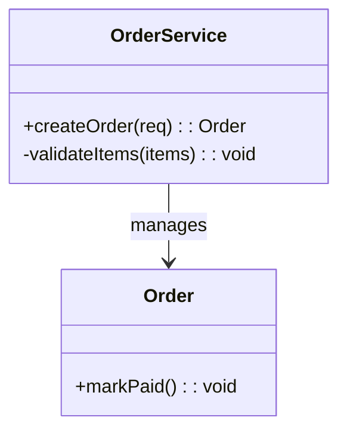
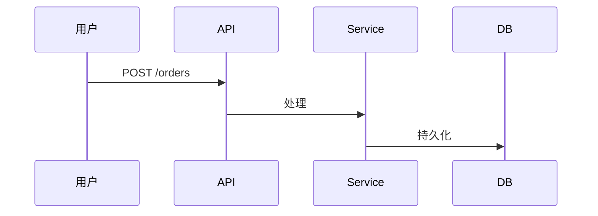
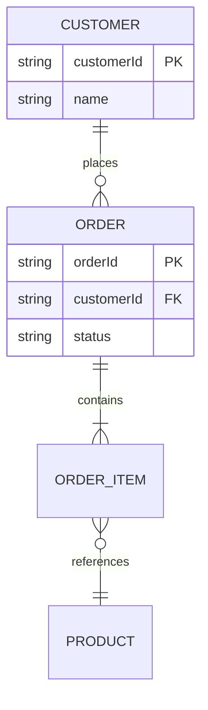

# 模板：3-详细设计

> 使用说明：`docs/3-详细设计.md`。**必产文档**——概要设计讲清"为什么这么搭"，详细设计讲清"每个模块具体怎么实现"——接口契约、数据结构、关键流程、非平凡算法、**数据库设计**。可按模块拆为多文件放进 `docs/detailed/` 子目录。叙述遵守 `_写作规范.md`。
>
> 红线：每个图后必须有文字解读；接口定义必须完整到下游工程师不用猜（编号 API-x）；伪代码只写给非平凡逻辑，不贴整段源码。状态流转：草稿 → 已冻结（确认点 1）。

---

# 详细设计：[项目名称]

| 项 | 内容 |
|---|---|
| 版本 | v1.0 |
| 日期 | YYYY-MM-DD |
| 状态 | 草稿 / 已冻结 |
| 上游 | 2-概要设计 vX.Y |
| 与代码同步截止 | |

## 文档导读

> 本文件按"宪法 → 模块 → 共享面"组织，读法如下：
> - **§0 公共约定**：全系统共享的命名/错误码/枚举/"参考源映射"，是所有模块的宪法，先读。
> - **§1~§2 各模块详设**：每个模块一节（职责 → 类结构 → 关键流程 → 非平凡算法 → 异常边界），只读你关心的模块。
> - **§3 接口设计**：全系统接口清单 + 逐接口契约（编号 API-x），是 spec.md 契约的内联源。
> - **§4 数据设计**：ER 全图 + 每张表独立小节的表结构 + 数据字典与索引策略（数据库设计的唯一归宿）。
> - **§5 横切机制**：日志/错误码/鉴权/事务/配置等跨模块机制。
>
> 阅读顺序建议：全新读者 §0 → §4（先看数据长什么样）→ §3 → 目标模块；改接口先查 [§3 接口清单](#3-接口设计)。

## 0. 公共约定（全模块共享，先于此冻结）

> 本节是所有模块设计的"宪法"：模块分册只引用本节，不复写。**任何模块设计与本节冲突，以本节为准，回头修订模块设计；确需修改本节，走变更流程（4-变更记录）**。

### 0.1 命名规范

（包/类/表/字段/接口/API 路径的命名规则；代码标识符英文、注释中文。）

### 0.2 公共响应与错误码

统一响应结构：（成功/失败的响应体格式，分页结构，时间格式，ID 类型）

| 错误码 | 含义 | HTTP 状态 |
|---|---|---|
| 例：`AUTH-001` | | |

### 0.3 枚举字典

（全系统枚举集中注册：状态机取值、类型字典——各模块只能引用，不得新增同义枚举。）

| 枚举 | 取值 | 说明 |
|---|---|---|
| | | |

### 0.4 参考源映射（有原型/旧代码/mock 数据时必填）

| 参考源 | 作用域 | 本设计继承点 |
|---|---|---|
| 例：旧版 mock_data.py | GUI 展示字段 | 字段映射见各模块详设 |

## 1. 模块 A 详设

### 1.1 职责

（这个模块拥有什么能力，一句话。实现需求分析的哪些 REQ。）

### 1.2 类结构

（图后解读：各类的职责、关键方法为什么长这样、关系是组合还是依赖。）

### 1.3 关键流程

（图后解读：正常路径怎么走；上面至少有一条错误路径（超时/库存不足/校验失败）。）

### 1.4 非平凡算法

（只有逻辑不直观时才写伪代码：状态机推进、并发去重、对账差异处理之类。平凡的 CRUD 不要贴代码凑数。）

### 1.5 异常与边界处理

| 场景 | 处理策略 | 关联 BR |
|---|---|---|
| | | |

## 2. 模块 B 详设

（结构同上，略。前端模块同样按 §1 结构详设：类结构 → 组件结构（组件树/状态管理/路由），核心流程 → 关键交互流程图，接口定义 → 组件 Props 契约。视觉 token 值以内联形式存在于 `ai-docs/spec.md` 工程约定节，实现时直接引用，不写死颜色/间距值。**前端占比高的项目：把前端各模块独立成节（如"## 2. 前端模块详设"，含组件树/状态管理/路由/Props 契约），不要塞在括号说明里。**）

## 3. 接口设计

### 3.1 接口清单

（每个接口一个编号 API-x，供追踪矩阵和变更影响分析引用。同一接口在模块详设、架构图、清单、spec.md 里出现时必须一字不差。）

| 接口编号 | 接口 | 方法 | 用途 | 关联模块 | 详设章节 |
|---|---|---|---|---|---|
| API-1 | | | | | [§1.3 关键流程](#13-关键流程) / [§2 模块B 详设](#2-模块-b-详设) |

### 3.2 接口契约

（每个接口一节，完整到调用方不用问。同一份接口在模块详设、架构图、清单里出现时必须一字不差。给 AI 用的契约同步内联到 `ai-docs/spec.md`。）

| 项 | 内容 |
|---|---|
| 操作 | `POST /orders` |
| 用途 | 创建订单 |
| 认证 | Bearer token，需 `order:create` 权限 |
| 请求体 | `items`（数组，必填，≥1 项）；`items[].sku`（string，必填）；`items[].qty`（int，必填，≥1） |
| 成功响应 | `201`；`{ orderId, status: "PENDING", createdAt }` |
| 错误码 | `400 INVALID_ITEMS` / `409 OUT_OF_STOCK` / `401 UNAUTHORIZED` / `429 RATE_LIMITED` |
| 幂等 | 通过 `Idempotency-Key` 请求头 |

## 4. 数据设计

### 4.1 实体关系全图

### 4.2 表结构定义

> **格式要求：每张表一个独立小节**，禁止把所有表的字段挤进一张大表。小节标题 = 表名 + 表注释；字段表列：字段名 / 类型 / 约束 / 字段注释。约束写全：主键（PK）、外键（FK→表.字段）、唯一（UNIQUE）、非空（NOT NULL）、默认值、CHECK。

#### store 门店表

| 字段 | 类型 | 约束 | 说明 |
|---|---|---|---|
| id | bigint | PK 自增 | 主键 |
| name | varchar(100) | NOT NULL, UNIQUE | 门店名称 |
| status | varchar(20) | NOT NULL, 默认 ACTIVE | ACTIVE/INACTIVE |

#### user 员工账号表

| 字段 | 类型 | 约束 | 说明 |
|---|---|---|---|
| id | bigint | PK 自增 | 主键 |
| store_id | bigint | FK→store.id | 归属门店（0=总部） |
| username | varchar(50) | NOT NULL, UNIQUE | 登录名 |

（有多少张表写多少个小节，一一展开，不合并。）

### 4.3 数据字典与索引策略

（字段业务含义；建了哪些索引、为什么。）

## 5. 横切机制

（日志规范、错误码体系、鉴权流程、事务边界、配置管理——如有。）
