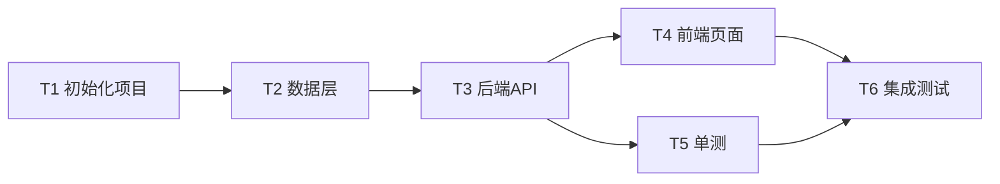

# 模板：execution-plan.md（AI 执行计划）

> 使用说明：AI 执行文档，存放于 `docs/ai-docs/`。自包含原则同 spec.md：执行任务时翻 spec.md / acceptance-criteria.md / test-plan.md（同目录）是允许的，翻 docs/ 下那些给人看的中文文档是禁止的。
>
> 本文档 = **执行纪律 + 工程拓扑 + 任务拆解**。执行纪律（§1）是本计划的宪法，任何任务不得违反；任务粒度以"一次上下文能完成并独立验证"为准；每个任务必须有可判定的完成定义（DoD）、验证命令，并回链上游编号。
>
> **大项目分册化**：任务超过 ~30 个时，建 `docs/ai-docs/execution-plan/` 目录——本文件降级为"执行计划总览"（保留 §1-§5），任务清单拆为迭代分册（`iter-01-基础设施.md` …），每分册含 bite-sized tasks、关键代码骨架、验证命令。**分册后**：全局追踪矩阵留在总览（§5），分册只列本册任务 + 依赖的分册/任务编号；跨分册依赖在总览 §3 依赖图中表达。
>
> 状态流转：草稿 → 已冻结（确认点 2）。

---

# 执行计划：[项目名称]

| 项 | 内容 |
|---|---|
| 版本 | v1.0 |
| 日期 | YYYY-MM-DD |
| 状态 | 已冻结 |
| 血缘（仅元信息） | 生成自 2-概要设计.md vX / 3-详细设计.md vX / spec.md vX |
| 与代码同步截止 | |

## 1. 执行纪律（宪法，任何任务不得违反）

### 1.1 核心原则

**基于已固化的契约写代码，不基于猜测写代码。** 契约未固化的依赖，宁可停下来，不许瞎猜接口。

### 1.2 契约优先模式

> **先看 spec.md §12.2 契约生命周期**：有详细设计的项目，契约已内联进 spec.md 即视为固化，本流程降级为"宣读"（照抄进代码，不重新设计）。只有 spec.md 里没有的接口/规则，才按本流程新输出并固化。

每个模块/任务组开始编码前，必须先输出并固化该模块的接口契约：

1. 对外暴露的接口清单（函数/Service 签名、参数、返回值、抛出的异常）
2. DTO/数据结构清单（字段、类型、约束）
3. 错误码清单（模块前缀 + 语义，如 `AUTH-001`）
4. API 契约（路径、方法、请求/响应格式，含 WebSocket/MQTT 等异步契约时一并列出）
5. 依赖的上游接口清单（本模块调用哪些上游已固化契约）

流程：

```
任务组开始
  → 输出接口契约（5 类清单）
  → 自查契约（与 spec.md 一致性、与上游契约一致性、命名规范）
  → 固化契约（单独 commit）
  → 写实现（只基于已固化的契约）
  → 写单元测试
  → 执行 §1.4 自查清单
  → 全部通过 → commit + tag → 下一任务组
```

### 1.3 串并行策略

**必须串行**（每条注明原因，按本项目实际裁剪）：

| 场景 | 规则 | 原因 |
|---|---|---|
| 有依赖关系的模块/任务 | 上游契约固化 + 自查 + commit 后，下游才能开始 | 并行会让下游瞎猜上游接口 |
| 前端与后端 | 后端 API 契约固化后前端才能开始 | 前端 HTTP 客户端必须基于已固化契约 |
| 数据库 DDL 与业务代码 | DDL 先于所有依赖它的任务 | Entity/ORM 依赖已固化的表结构 |

**允许并行**：依赖同一已固化上游、且互不引用代码的任务，可标 [P] 并行。并行约束：互不引用代码、各自独立 commit、各自独立自查。

### 1.4 AI 自查清单（每个任务组编码完成后强制执行，无需人工介入）

- [ ] **契约一致性**：实现签名/字段/错误码/API 格式与固化的契约一致
- [ ] **跨任务引用合法**：未调用未固化契约的下游；调用上游时类型一致；未硬编码应由上游提供的值
- [ ] **测试质量**：关键路径有单测（非 100% 行覆盖）；测试验证意图（WHY）非行为（WHAT）；边界条件有测试
- [ ] **静态校验**：构建/编译通过、单测全绿、无 lint 警告

### 1.5 Git 提交节奏

> **宿主环境降级**：若宿主不允许 AI 自由 commit/tag（需逐次审批或被禁用），以"契约文件单独产出为独立文件 + 用户确认"替代"单独 commit 固化"动作；commit 与 tag 改为由用户手动执行，纪律其余部分不变。

| 时机 | 提交内容 | 提交信息 |
|---|---|---|
| 契约固化后 | 接口定义文件 | `feat(module-n): 定义接口契约` |
| 任务组完成后 | 实现 + 单元测试 | `feat(module-n): 完成实现与单测` |
| 自查通过后 | 仅 tag | `git tag module-n-done` / `git tag milestone-M-done` |

### 1.6 失败处理策略

| 场景 | 处理 |
|---|---|
| 自查不通过 | 当场修复直到通过再 commit，不跳过、不挂 issue 继续 |
| 同一问题连续 3 次修复仍不通过 | 停下来，记录原因，向用户报告（允许调整设计或计划） |
| 发现上游契约不合理 | 停下来报告用户，禁止单方面改上游已固化的契约 |
| 外部依赖未就绪导致测试无法跑 | 单测用 mock，标记为待集成验证项，记入风险表 |

## 2. 工程拓扑

### 2.1 顶级工程结构

（annotated tree：每个目录一行注释，说明放什么、属于哪个任务组）

```text
project/
├── backend/            # 后端工程（任务组 T-x ~ T-y）
│   └── ...
├── frontend/           # 前端工程（任务组 T-z）
└── deploy/             # 部署配置
```

### 2.2 模块/任务组依赖关系

```text
common（基础层，无依赖）
  ↑
module-a ← 依赖 common
module-b ← 依赖 common + module-a
```

### 2.3 跨工程依赖

| 下游 | 上游 | 依赖内容 |
|---|---|---|
| 例：frontend | backend | HTTP 调用 REST API（基于已固化契约） |

### 2.4 数据存储/中间件依赖

| 存储/中间件 | 初始化任务 | 依赖方 |
|---|---|---|
| 例：PostgreSQL | T-2 | 业务模块 T-5 起 |

## 3. 任务依赖图

> [P] 标记表示可与其他 [P] 任务并行执行（须满足 §1.3 约束）。



## 4. 任务清单

### T-1：[标题]

- 目标：
- 输入：（依赖的上游任务 / spec.md 条目）
- 动作：
  1. （步骤写到可直接照做的粒度；需要的接口签名、表结构、配置键在此内联）
  2.
- 产出：（要创建/修改的文件清单）
- 完成定义（DoD）：（可判定，例：目录结构存在 + `npm run build` 通过）
- 验证命令：（执行哪条命令确认本任务完成，见 spec.md §11）
- 关联：REQ-F-x.y / AC-x.y

### T-2：[标题]

（结构同上，略）

### T-N：[前端任务示例] 页面原型/页面实现

- 目标：实现 [页面名] 的 HTML 原型/前端页面
- 输入：spec.md §4 对应页面条目（元素清单/交互/五态）+ 工程约定中的前端设计变量（token 值）
- 动作：
  1. 按元素清单搭建页面结构，颜色/间距/字体全部使用 token 变量，禁止硬编码色值
  2. 实现交互行为（用户动作 → 系统响应 → 界面变化）
  3. 补齐空/加载/错误/无权限四态
- 产出：`src/pages/[页面].html`（或对应框架组件文件路径）
- 完成定义（DoD）：五态齐全 + 关联 UI 类 AC 通过 + 无硬编码色值
- 验证命令：（启动命令 + 浏览器自查要点）
- 关联：REQ-F-x.y / AC-x.y

## 5. 全局追踪矩阵（变更影响分析的唯一入口）

> 每完成一个任务回填 T 列状态（执行 AI 在任务完成时回填，验收时人工复核）。任何变更（见 4-变更记录流程）先查此表确定受影响面。**有接口编号的项目（API-x）**：接口归属哪行，改接口时按 API-x 反查对应任务与用例。

| REQ | AD（设计决策） | API（接口，如有） | T（任务） | AC（验收） | TC（用例） | 状态 |
|---|---|---|---|---|---|---|
| REQ-F-1.1 | AD-1 | API-1 | T-3 | AC-1.1 | TC-1 | 未开始/进行中/已完成 |

## 6. 里程碑

| 里程碑 | 包含任务 | 出口条件 |
|---|---|---|
| M1 | T1-T2 | |

## 7. 风险与应对

> **风险编号 SSOT**：调研期风险（RSK-x）已在 1-需求分析 §9 定义，此处**引用而非重定义**（同一编号只能有一个含义，禁止两处定义不同风险）。本节只补充执行期新发现的风险，编号从需求分析已有的最大 RSK 号接续（如需求分析到 RSK-4，本节新增从 RSK-5 起）。

| 编号 | 风险 | 影响 | 应对 | 来源 |
|---|---|---|---|---|
| RSK-1 | | | | 引用自 需求分析 §9 |
| RSK-5（新增） | | | | 执行期新发现 |
