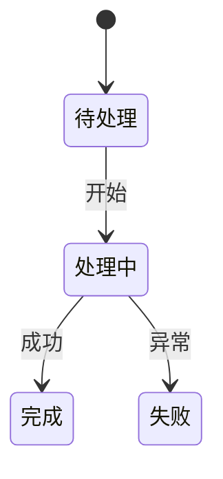

# 模板：spec.md（AI 执行规格说明书）

> 使用说明：AI 执行文档，存放于 `docs/ai-docs/`。**自包含（Self-Contained）是本文档的最高原则**：AI 仅凭 `docs/ai-docs/` 目录下的四份文档即可完整执行开发，不需要 docs/ 下那些给人看的文档。因此：
>
> 1. 所有执行所需的事实必须写在本文档内——需求描述、业务规则、接口、数据结构、技术栈、命令、前端 token 值，禁止出现"见需求分析 / 见设计决策"之类的内容引用（文件头"血缘"元信息除外）。
> 2. 不追求人类可读性，追求无歧义、可机械执行：条目化、编号化、无叙事。
> 3. 若执行中发现本文档与代码现实矛盾，以本文档"范围边界 + 禁止行为"为准，并停下来向用户报告。
>
> 状态流转：草稿 → 已冻结（确认点 2）。

---

# SPEC：[项目名称]

| 项 | 内容 |
|---|---|
| 版本 | v1.0 |
| 日期 | YYYY-MM-DD |
| 状态 | 已冻结 |
| 血缘（仅元信息） | 生成自 1-需求分析.md vX / 2-概要设计.md vX / 3-详细设计.md vX，执行时不依赖它们 |
| 与代码同步截止 | |

## 1. Why / What Changes / Impact

- **Why**（为什么做）：（2-4 句，说清系统解决什么问题、给谁用。只写执行所必需的最小背景）
- **What Changes**（本期做什么）：（一句话范围摘要，例：新增 X 系统，覆盖 REQ-F-1 ~ REQ-F-x；各需求的变更类型见其条目标签）
- **Impact**（影响面）：（是否 BREAKING；影响 execution-plan §5 全局追踪矩阵的哪些行；对已有代码/数据的影响与迁移要求）
- **成功指标**：（可测量，例：核心接口 P95 < 500ms；全部 P0 验收通过）

## 2. 术语表

（AI 必须理解的领域术语。歧义术语禁止带入开发。）

| 术语 | 定义 |
|---|---|
| | |

## 3. 技术栈与依赖

| 项 | 确定值 | 约束 |
|---|---|---|
| 语言及版本 | 例：Node.js 20 LTS | 不许更换 |
| 框架及版本 | 例：Express 4.x | 不许更换 |
| 数据库 | 例：PostgreSQL 15 | |
| 第三方依赖 | 逐个列出：名称 + 版本 + 用途 | 新增依赖属禁止行为 |
| 构建/包管理 | 例：npm 10 | |

## 4. 需求全集

> 自包含核心：每条需求的完整描述写在这里，不是只写编号。执行时不得回查 docs/ 下给人看的文档。含前端时，前端页面需求按页面成条，内联页面契约：路由 + 元素清单（名称/类型/约束）+ 交互行为 + 五态（正常/空/加载/错误/无权限）。
>
> **超大体量分册**：若 REQ 数量超过执行上下文承载（几十上百条 REQ + 全部契约内联），镜像 execution-plan 的分册做法——本文件降级为"总纲"（保留 §1-§5、§11-§14），需求全集与契约拆到 `ai-docs/spec/` 模块分册，总纲里放各分册索引。自包含原则不变：分册之间可互引，仍禁止引用 docs/ 给人看的文档。

### REQ-F-1.1 [标题] [ADDED]

- **规范**（EARS 句式）：（当 <触发条件> 时，系统应 <动作+对象+边界>；异常类需求用：若 <非期望条件>，则系统应 <处理>）
- **补充说明**：（领域细节、歧义消除；适用业务规则编号 BR-x，规则全文见 §7）
- **一句话验收**：
- **来源**：（与 1-需求分析同名编号对应，仅为变更追溯用；条目尾的变更类型标签 [ADDED]/[MODIFIED]/[REMOVED] 由变更流程维护）

### REQ-F-1.2 [标题]

（同上结构）

### 非功能需求

> 类目基准：性能 / 安全 / 兼容性 / 易用性（与 1-需求分析 §6 共用，缺类"不适用"）。

| 编号 | 类别 | 指标（可测量） | 验收方法 |
|---|---|---|---|
| REQ-NF-1 | 性能/安全/兼容性/易用性 | | |

## 5. 范围边界

### 5.1 本期必须实现

- REQ-F-1.1、REQ-F-1.2 …（逐条列出）

### 5.2 本期禁止实现（Out of Scope）

- （逐条；实现了即验收不通过，对应 AC-E-x）

## 6. 输入输出契约

（每个契约一个编号 API-x，与详细设计 §3 的接口编号一一对应；追踪矩阵和变更影响分析按 API-x 反查。）

### 6.1 输入

| API 编号 | 名称 | 类型 | 必填 | 约束（长度/格式/枚举） | 示例 |
|---|---|---|---|---|---|
| API-1 | | | 是/否 | | |

### 6.2 输出

| API 编号 | 名称 | 类型 | 说明 | 示例 |
|---|---|---|---|---|
| API-1 | | | | |

## 7. 业务规则

| 编号 | 规则全文 | 适用 REQ |
|---|---|---|
| BR-1 | | REQ-F-x.y |

## 8. 状态机

| 状态 | 进入条件 | 允许操作 | 离开条件 | 展示/行为 |
|---|---|---|---|---|
| | | | | |

## 9. 错误处理策略

| 项 | 规定 |
|---|---|
| 错误码体系 | 例：`{模块}_{原因}` 大写下划线，全局唯一 |
| 已定义错误码 | 表：错误码 / 触发条件 / HTTP 状态 / 返回体 |
| 重试策略 | 例：网络类错误重试 3 次（指数退避），业务类错误不重试 |
| 超时 | 例：外部调用超时 3s；端到端 10s |
| 幂等 | 例：写接口必须支持幂等键 |
| 降级/兜底 | 例：推荐服务挂了返回默认列表，不阻断主流程 |

## 10. 验收场景索引

> 完整 Given-When-Then 断言见同目录 acceptance-criteria.md，禁止在本文档重复抄写。

| AC 编号 | 标题 | 关联 REQ | 判定摘要 |
|---|---|---|---|
| AC-1.1 | | REQ-F-1.1 | |

## 11. 工程约定

| 项 | 规定 |
|---|---|
| 目录结构 | （要求 AI 创建的目录树） |
| 代码风格 | 例：ESLint 配置强制；命名规范 |
| 构建命令 | 例：`npm run build` |
| 启动命令 | 例：`npm run dev`（监听端口） |
| 测试命令 | 例：`npm test`（单测）、`npm run test:e2e` |
| Lint 命令 | 例：`npm run lint` |
| 环境变量 | 逐个列出：名称 / 用途 / 是否必填 / 示例值 |
| 配置文件 | 例：`config/default.yaml` 的键清单 |
| 前端设计变量 | 含前端时：内联关键 token 值表（颜色/间距/字体/圆角/阴影，实现页面时直接使用，禁止自创色值）。**设计稿没给的 token**：列为 TBD（带建议值）或从 HTML 原型取色，禁止凭空自创 |

## 12. 设计约束与禁止行为

### 12.1 架构级设计约束（可机械判定）

| 约束 | 落地点 | 禁止行为 | 判定方法 |
|---|---|---|---|
| 例：业务层与 UI 层物理隔离 | `core/` 不依赖任何 UI 框架 | 在业务层 import UI 控件类 | 在无 UI 环境的 CI 跑通全部业务单测 |
| 例：错误处理统一走错误码体系 | 全局异常处理器 | 业务代码直接返回裸字符串错误 | 代码搜索无 `return "错误"` 模式 |
| | | | |

### 12.2 流程级禁止行为

- 禁止修改数据库 schema（除非任务 T-x 明确要求）
- 禁止输出/记录敏感信息（密钥、密码、token）
- 禁止引入 §3 依赖清单之外的第三方依赖
- 禁止"顺手优化"与本 SPEC 无关的已有代码
- 禁止实现 §5.2 列出的任何排除项
- 禁止修改任何已固化的接口契约（发现不合理→停下来报告用户，见 execution-plan.md §1.6）

#### 契约生命周期（"已固化"指什么，一次说清）

- **默认（有 3-详细设计）**：接口契约在确认点 1 已由 `3-详细设计.md` §3 设计完成并内联进本文件，**进入本文件即视为已固化**。execution-plan §1.2 的"契约优先"流程对已内联的契约降级为**宣读**（照抄进代码），不再重新设计。
- **例外（概要设计被省、详设极简、契约未内联）**：以 execution-plan §1.2 的流程为准——每个任务组编码前先输出并固化（单独 commit），固化后不得单方面修改。
- 判定"是否已固化"：查本文件 §6 输入输出契约与 §7 业务规则是否已含该接口/规则；已含→固化，未含→走 §1.2 流程。

## 13. 遗留事项（明确不在本期，保留扩展入口）

> 与 TBD 的区别：TBD 是待用户拍板的事项，遗留事项是**已决定本期不做**、但为未来预留入口的事项。实现它们不属于本期验收范围，也不违反范围边界。

| 事项 | 状态 | 未来入口 |
|---|---|---|
| 例：深色主题 | 遗留 | 设置页已留主题选项占位 |

## 14. 完成定义（Definition of Done）

- 全部 T-x 完成且通过其关联 AC
- 通过 test-plan.md 中全部 P0 用例
- §11 所列构建 / Lint / 测试命令全部通过
- execution-plan.md 的"AI 自查清单"全部通过
- 核心业务规则（BR-x）有测试（测试验证意图 WHY，非行为 WHAT）
