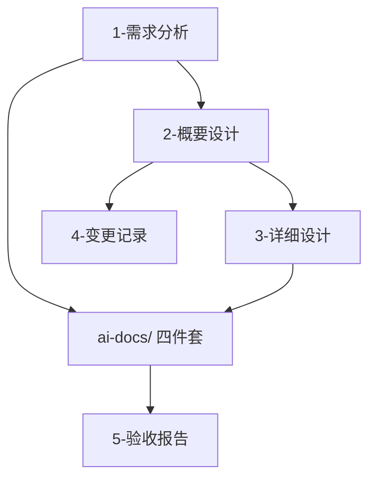

# 模板：文档清单与导航（可选，文档超过 6 份时生成）

> 使用说明：`docs/文档清单与导航.md`。它是整个文档组的导航中枢，回答"谁该读什么、文档之间什么关系、文档对应代码在哪里、什么算冻结"；同时是**文档状态的唯一权威**（各文档头部的"状态"字段应写"见文档清单与导航"）。随文档组变更同步更新（每份文档升版时更新对应行）。叙述遵守 `_写作规范.md`。

---

# 文档清单与导航：[项目名称]

**更新日期：** YYYY-MM-DD
**文档总数：** N 份（给人看的 M 份 / 给 AI 看的 K 份）
**项目阶段：** （需求确认 / 设计冻结 / 执行中 / 已交付）

## 1. 项目数字速查板（一致性哨兵）

> 每次文档改版后核对这些数字——对不上说明有文档没同步。这是防漂移的最廉价手段。

| 项 | 数量 | 说明 |
|---|---|---|
| 需求（REQ） | | 含功能与非功能 |
| 模块 | | 以概设模块总览表为准 |
| 接口（API） | | 以详设/ spec 一致数为准 |
| 业务规则（BR） | | |
| 任务（T） | | |
| 验收标准（AC） | | 含 AC-E / AC-NF |
| 自测用例（TC） | | |
| 错误码 | | |

## 2. 确认点定义（本项目用到哪些关卡）

> 全库引用的"确认点 0/1/2"统一在此定义，别处只引用不另说。

| 确认点 | 关卡 | 谁确认 | 确认什么 |
|---|---|---|---|
| 确认点 0 | 需求输入定稿 | 用户 | 需求条目全集（分支 A 调研结果 / 分支 B 拆解结果） |
| 确认点 1 | 人类文档冻结 | 用户 | README / 需求分析 / 概要设计 / 详细设计 / 变更记录（交一页摘要） |
| 确认点 2 | AI 四件套冻结 | 用户 | spec / execution-plan / acceptance-criteria / test-plan（装傻测试 + 生成期对账通过） |

## 3. 文档体系总览

## 4. 文档清单（状态唯一权威）

> 每份文档头部的"状态"字段写"见本文档"。状态取值：草稿 / 已冻结 / 已废弃（REMOVED 需求相关条目）/ 已回填。

| 层 | 文档 | 版本 | 状态 | 路径 | 内容摘要 |
|---|---|---|---|---|---|
| 给人看 | README | | | `README.md` | 定位/索引/执行入口 |
| 给人看 | 1-需求分析 | | | | |
| 给人看 | 4-变更记录 | | | | |
| 给人看 | 2-概要设计 | | | | AD-x 唯一家 |
| 给人看 | 3-详细设计 | | | | |
| 给人看 | 5-验收报告 | | | | |
| 给 AI | spec.md | | | `ai-docs/` | |
| 给 AI | execution-plan.md | | | `ai-docs/` | |
| 给 AI | acceptance-criteria.md | | | `ai-docs/` | |
| 给 AI | test-plan.md | | | `ai-docs/` | |

## 5. 角色阅读路径

| 角色 | 阅读路径 |
|---|---|
| 管理者/决策者 | README → 1-需求分析（背景与目标） → 2-概要设计（架构） |
| 后端开发 | ai-docs/spec → execution-plan → 3-详细设计（对应模块） |
| 前端开发 | ai-docs/spec → execution-plan → 原型 → 3-详细设计（前端模块） |
| 新加入成员 | README → 1-需求分析 → 2-概要设计 → 按角色选读 |
| 验收/测试 | acceptance-criteria → test-plan → 5-验收报告 |

（按项目实际角色裁剪。）

## 6. 文档与代码目录对应

| 文档 | 代码目录 |
|---|---|
| 3-详细设计-数据模型 | `database/migrations/` |
| execution-plan | `backend/`、`frontend/` |

## 7. 冻结条件与变更流程

**冻结条件**：该阶段确认点（见 §2）通过 + 用户确认 + 版本号写入本文档。

**变更流程**：任何变更先入 `4-变更记录.md` → 用追踪矩阵（ai-docs/execution-plan §5）确定受影响面 → 两组文档同步增量修订 → 本文档对应行升版、数字速查板核对。禁止绕过变更记录直接改文档。

## 8. 文档质量保障

- 每份文档交付前过对应确认点的自查清单（见技能 checklists.md）
- 每个迭代结束做文档与代码一致性检查（实现 vs 契约）：**发现冲突先走文档变更流程（4-变更记录），再动代码**——禁止绕过变更记录直接改文档
- 可选：引入第三方 AI 评审，评审意见入 4-变更记录，按 P0/P1/P2 分级处理
