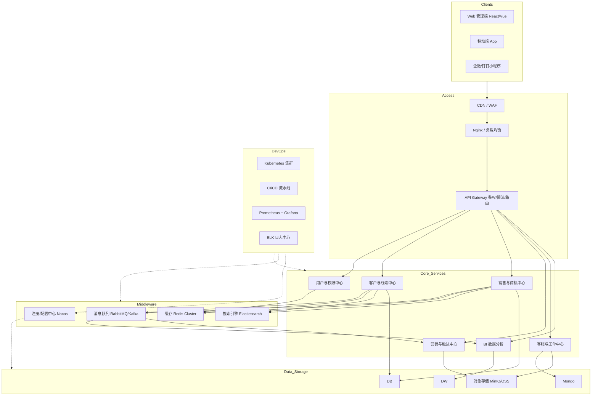

------

# 典型前后端分离 CRM 系统架构设计文档

## 1. 架构概述

本 CRM 系统采用**前后端分离**架构，前端负责用户交互与状态管理，后端提供 RESTful/GraphQL API 服务。整体架构遵循高内聚、低耦合原则，支持水平扩展，并引入微服务/模块化思想以应对复杂的客户关系管理业务。

## 2. 核心架构分层 (自顶向下)

### 2.1 客户端层 (Client Layer)

- **Web 管理端**: 基于 Vue3/React + TypeScript，使用 Ant Design/Element Plus 组件库。
- **移动端**: 响应式 H5 或原生 App (Flutter/React Native)，供销售人员外勤使用。
- **小程序端**: 微信/钉钉/企微小程序，用于客户快速录入与消息通知。

### 2.2 接入与网关层 (Access & Gateway Layer)

- **CDN / WAF**: 静态资源加速与 Web 应用防火墙。

- **负载均衡 (Nginx/ALB)**: 流量分发，SSL 卸载。

- API 网关 (Kong / Spring Cloud Gateway)

  : 

  - 统一路由与鉴权 (JWT/OAuth2)
  - 限流、熔断、降级
  - 请求日志与链路追踪入口

### 2.3 业务服务层 (Business Service Layer)

*采用微服务或模块化单体架构，核心领域划分如下：*

- **用户与权限中心 (UAC)**: RBAC 模型，组织架构，数据权限（如：销售只能看自己的客户）。
- **客户中心 (Customer Domain)**: 客户画像，线索 (Leads)，公海/私海池，联系人管理。
- **销售与商机中心 (Sales Domain)**: 销售漏斗，商机阶段，报价单，合同管理。
- **营销与触达中心 (Marketing)**: 邮件/短信发送，活动管理，渠道追踪。
- **客服与工单中心 (Support)**: 投诉处理，SLA 管理，知识库。
- **数据分析中心 (BI)**: 销售报表，业绩看板，数据导出。

### 2.4 基础设施与中间件层 (Infrastructure & Middleware)

- **服务注册与发现**: Nacos / Consul / Eureka
- **配置中心**: Nacos / Apollo
- **消息队列**: RabbitMQ / Kafka (用于异步任务：如发送邮件、数据同步、操作日志)
- **缓存**: Redis Cluster (热点数据、分布式锁、Session)
- **搜索引擎**: Elasticsearch (客户/合同全文检索，复杂条件筛选)
- **对象存储**: MinIO / OSS (头像、合同附件、录音文件)

### 2.5 数据持久层 (Data Persistence Layer)

- **关系型数据库**: MySQL / PostgreSQL (主从复制，读写分离)
- **文档数据库**: MongoDB (非结构化客户行为日志、沟通记录)
- **数据仓库**: ClickHouse / StarRocks (海量数据 OLAP 分析)

### 2.6 运维与可观测性 (DevOps & Observability)

- **CI/CD**: GitLab CI / Jenkins / ArgoCD
- **容器化**: Docker + Kubernetes (K8s)
- **监控告警**: Prometheus + Grafana
- **日志中心**: ELK (Elasticsearch + Logstash + Kibana) / Loki
- **链路追踪**: SkyWalking / Jaeger

------

## 3. 关键数据流向说明 (用于绘制连线)

1. **用户请求流**: 浏览器 -> CDN -> Nginx -> API Gateway -> 具体业务微服务 -> MySQL/Redis -> 返回 JSON。
2. **异步任务流**: 业务微服务 -> 发送 MQ 消息 -> 消息队列 -> 消费者服务 (如：通知服务/BI 统计服务) -> 更新数据库/ES。
3. **文件上传流**: 前端 -> 获取 OSS 临时凭证 -> 前端直传 OSS -> 回调业务服务保存文件元数据。
4. **数据检索流**: 前端输入关键字 -> API Gateway -> 搜索服务 -> Elasticsearch -> 返回结果集。

------

## 4. 架构图生成建议 (Prompt 提示)

> **💡 如果你使用 AI 绘图工具，可以直接复制以下 Prompt：**
>
> "请根据以下描述生成一张企业级前后端分离 CRM 系统架构图。采用自上而下的分层布局：
>
> 1. 顶层是客户端（Web、App、小程序）。
> 2. 第二层是接入层（CDN、Nginx、API Gateway）。
> 3. 第三层是核心业务微服务集群（用户权限、客户管理、销售商机、营销、客服、BI分析），服务之间通过内部 RPC/HTTP 通信。
> 4. 第四层是中间件集群（Redis、RabbitMQ、Elasticsearch、Nacos）。
> 5. 底层是数据存储（MySQL、MongoDB、OSS、ClickHouse）。
> 6. 右侧纵向贯穿 DevOps 体系（K8s、CI/CD、Prometheus、ELK）。
>    风格要求：现代科技感，使用蓝色和灰色调，图标清晰，连线表示数据流向。"

------

## 5. Mermaid 代码示例 (可直接渲染)

如果你使用支持 Mermaid 的 Markdown 编辑器（如 Notion, Obsidian, GitHub），可以直接粘贴以下代码生成图表：

这份文档涵盖了从前端到基础设施的完整链路，逻辑严密，非常适合用于技术评审或生成专业的架构拓扑图。